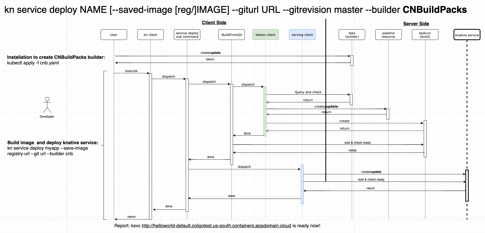

# kn image plugin

## Prerequisite
Before you begin this task, you should prepare a kubernetes cluster which has been installed tekton-pipeline and access it.
### Confirm tekton-pipeline has been installed

```
> kubectl get pod -n tekton-pipelines
NAME                                           READY   STATUS    RESTARTS   AGE
tekton-pipelines-controller-6d8f8c4f66-6lcwf   1/1     Running   0          5d4h
tekton-pipelines-webhook-5697f86c7c-d5c9r      1/1     Running   0          3d
tekton-triggers-controller-5f58c5775f-zshvf    1/1     Running   0          5d4h
tekton-triggers-webhook-74497cb8dd-h9qxd       1/1     Running   0          3d
```
Ensure all pods are `running`.

## Create build task first
Please create the build task first from https://github.com/tektoncd/catalog
### Such as buildpacks build task:
- Download yaml from https://github.com/tektoncd/catalog/blob/master/buildpacks/buildpacks-v3.yaml as buildpacks-v3.yaml
- `kubectl apply -f buildpacks-v3.yaml`
You can use `kubectl get task` command to see the task. It's output should like below:

```
NAME            AGE
buildpacks-v3   4d21h
```
### Such as kaniko build task:
- Download yaml from https://github.com/tektoncd/catalog/blob/master/kaniko/kaniko.yaml
- `kubectl apply -f kaniko.yaml`

## Prepare secrets
We need two secrets. One for pushing images and another for pulling images
### Secret for pushing image
In order to push image to the registry, we need to get the permission. So this secret will be used to access the registry. Create a secret yaml file name `ImagePushSecret.yaml`

```
apiVersion: v1
data:
  password: <docker_password>
  username: <docker_username>
kind: Secret
metadata:
  annotations:
    tekton.dev/docker-0: us.icr.io
  name: ibm-cr-push-secret
  namespace: default
type: kubernetes.io/basic-auth
```
Run it with:

```
kubetl create -f ImagePushSecret.yaml
```
### Secret for pulling image
Besides, if your cluster account is not same with the account of container registry. Then maybe you also need to prepare another secret for pulling an image. Create a pull image secret called `ibm-cr-pull-secret`.

```
kubectl create secret docker-registry ibm-cr-pull-secret --docker-server=us.icr.io --docker-username=iamapikey --docker-password=${apikey} --docker-email=me@here.com
```
Note: docker-password is the apikey of the account of container registry

## Create a ServiceAccount
Create a seviceaccount yaml file named `sa.yaml`

```
apiVersion: v1
imagePullSecrets:
- name: ibm-cr-pull-secret
kind: ServiceAccount
metadata:
  name: pipeline-account
  namespace: default
secrets:
- name: ibm-cr-push-secret
```
Run it with:

```
kubectl create -f sa.yaml
```

## Deploy Knative service by using buildpacks builder task
You can use `deploy` command line interface to deploy the image.

```
  kn image deploy ${image_name} \
    --builder buildpacks-v3 \
    --git-url ${url_of_git_repo} \
    --git-revision ${revision_of_git_repo} \
    --saved-image ${generated_image_path} \
    --serviceaccount ${ServiceAccount_for_ pushing_image} \
    --namespcae ${namespace} --force
```
Now, we have 8 parameters, they are:
- `--image_name`: generated image name
- `--builder`: a builder can be used to build image
- `--git-url`: the url of git repo
- `--git-revision`: revision of the relative git repo
- `--saved-image`: generated image path
- `--serviceaccount`: a ServiceAccount for pushing image
- `--namespace`: a namespace for building images. If you don't specify, it is default
- `--force`: create service forcefully, replaces existing service if any. Default is false

## Redeploy Knative service
Sometimes, we want to modify some parameters and redeploy this image. Then we can use `redeploy` CLI to achieve our targets.
For example, we only want to change the git-revision, then we can simply use below command to come true:

```
  kn image redeploy ${image_name} \
    --saved-image ${new_path_of_generated_image} \
    --git-revision ${new-revision} \
    --namespcae ${namespace}
```

## Deploy Knative service by kaniko builder task
You can also use `kaniko` builder to deploy images, all steps are same with `buildpacks`. Below is an example about the deployment using kaniko:

```
  kn image deploy kanikotest \
    --builder kaniko \
    --git-url https://github.com/bluebosh/knap-example \
    --saved-image us.icr.io/knative_jordan/kanikotest:latest \
    --serviceaccount default \
    --force
```

## Example Workflow
There will provide an example to deploy and reploy an image
1. Create a CR namespace to store images

```
ibmcloud login
ibmcloud cr login
CR_NAMESPACE=knative_test
ibmcloud cr namespace-add $CR_NAMESPACE
```

2. Access your cluster has been instlled tekton-pipeline

```
ibmcloud login
ibmcloud ks cluster-config --cluster ${cluster_name}
```

3. Use buildpacks-v3 builder to deploy an image named `kntest` and push it to `us.icr.io/knative_test/kntest:v1`

```
kn image deploy kntest --builder buildpacks-v3 --git-url https://github.com/zhangtbj/cf-sample-app-go --git-revision master --saved-image us.icr.io/knative_test/kntest:v1 --serviceaccount pipeline-account --force
```
Command result:

```
kn image deploy kntest --builder buildpacks-v3 --git-url https://github.com/zhangtbj/cf-sample-app-go --git-revision master --saved-image us.icr.io/knative_jordan/kntest:v1 --serviceaccount pipeline-account --force

[INFO] Deploy from git repository to Knative service
[INFO] Building image kntest in namespace default
[INFO] By using builder buildpacks-v3 and service account pipeline-account
[INFO] From git repo https://github.com/zhangtbj/cf-sample-app-go revision master
[INFO] Get task buildpacks-v3 successfully
[INFO] git resource kntest-git doesn't exist, creating
[INFO] Image resource kntest-image doesn't exist, creating
[INFO] Start task run for image kntest
[INFO] Build task run kntest-build-jhcwz is still Pending , waiting
[INFO] Build task run kntest-build-jhcwz is still Running , waiting
[INFO] Build task run kntest-build-jhcwz is still Running , waiting
[INFO] Build task run kntest-build-jhcwz is still Running , waiting
[INFO] Build task run kntest-build-jhcwz is still Running , waiting
[INFO] Build task run kntest-build-jhcwz is ready from 2019-12-02 14:58:51 +0800 CST to 2019-12-02 14:59:39 +0800 CST
[INFO] Complete task run kntest-build-jhcwz successfully
[INFO] Complete building application kntest image in namespace default
[INFO] Generate image us.icr.io/knative_jordan/kntest:v1 from git repo

[INFO] Deploy the Knative service by using the new generated image
[INFO] Service kntest successfully created in namespace default
[INFO] service kntest is ready
[INFO] Service kntest url is http://kntest.default.knative-test-cluster-812055c95ca491d26663547d616d3c7b-0001.us-south.containers.appdomain.cloud
```

4. View all resources and related logs

```
kubectl get pipelineresource
kubectl get taskrun
kubectl logs ${pod_name} --all-containers=true
```
5. Access the knative service
If deploy successfully, then you can see a url and open it. It's output like below:

```
kubectl get ksvc
NAME     URL                                                                                                                    LATESTCREATED   LATESTREADY    READY   REASON
kntest   http://kntest.default.knative-test-cluster-812055c95ca491d26663547d616d3c7b-0001.us-south.containers.appdomain.cloud   kntest-v52nn    kntest-v52nn   True
curl http://kntest.default.knative-test-cluster-812055c95ca491d26663547d616d3c7b-0001.us-south.containers.appdomain.cloud
Helloworld from master branch!
```

6. Reploy above image and Access the knative service

```
kn image redeploy kntest --git-revision develop --saved-image us.icr.io/knative_test/kntest:v2 --namespace default
```
For the redeployed image, we change the git-revision from master to develop. At the same, we access the knative service, it should be changed into:

```
Helloworld from develop branch!
```

Command Result:

```
[INFO] Redeploy Knative service by special settings
[INFO] Building image kntest in namespace default
[INFO] By using builder buildpacks-v3 and service account pipeline-account
[INFO] From git repo https://github.com/zhangtbj/cf-sample-app-go revision develop
[INFO] Get task buildpacks-v3 successfully
[INFO] git resource kntest-git exists, updating
[INFO] Image resource kntest-image exists, updating
[INFO] Start task run for image kntest
[INFO] Build task run kntest-build-kpwdk is still Pending , waiting
[INFO] Build task run kntest-build-kpwdk is still Running , waiting
[INFO] Build task run kntest-build-kpwdk is still Running , waiting
[INFO] Build task run kntest-build-kpwdk is still Running , waiting
[INFO] Build task run kntest-build-kpwdk is still Running , waiting
[INFO] Build task run kntest-build-kpwdk is ready from 2019-12-02 15:10:38 +0800 CST to 2019-12-02 15:11:27 +0800 CST
[INFO] Complete task run kntest-build-kpwdk successfully
[INFO] Complete building application kntest image in namespace default
[INFO] Generate image us.icr.io/knative_jordan/kntest:v2 from git repo

[INFO] Redeploy the Knative service by using the new generated image
[INFO] Service kntest successfully replaced in namespace default
[INFO] service kntest is ready
[INFO] Service kntest url is http://kntest.default.knative-test-cluster-812055c95ca491d26663547d616d3c7b-0001.us-south.containers.appdomain.cloud
```

## Work flow

